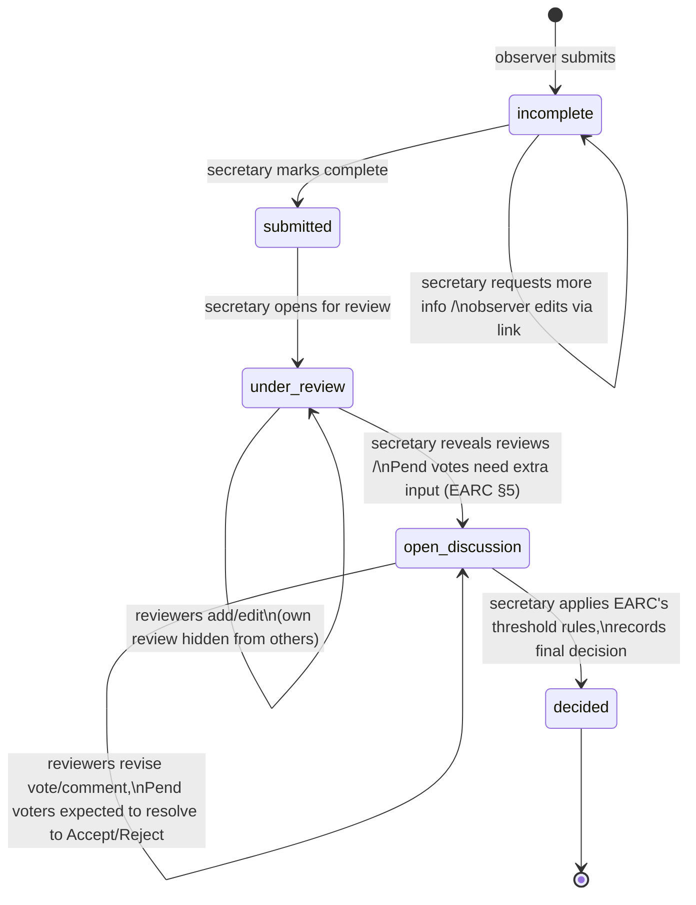

# Kenya Rare Bird Records System — Technical Specification

**Status**: design complete, ready to build. **Stack**: Supabase (Postgres + Auth + Storage + Row-Level Security) with a hand-built JavaScript frontend. This is the single, consolidated technical reference — architecture, requirements, data model, and every open decision — superseding the earlier drafts.

**This revision**: reviewed against the live East African Rarities Committee site ([eararities.org](https://www.eararities.org/)) — home, [submissions](https://www.eararities.org/submissions.html), [consideration procedure](https://www.eararities.org/consideration.html), and [form](https://www.eararities.org/form.html) pages — so this system carries over EARC's actual existing rules (who decides, what counts as a complete submission, the real decision categories and acceptance thresholds) rather than inventing new ones. Changes from that review are marked **[EARC]** throughout. One limitation: the actual submission form is a Word document (`EARCRarityFormAugust2020.doc`) that couldn't be machine-read from the site — the field list below is inferred from the surrounding guidance pages, not copied field-for-field from that document. **If exact parity with the current form matters, share that .doc directly and I'll reconcile it precisely.**

---

## 1. Purpose

Digitise the rare-bird-record review process EARC already runs by email: an observer reports an unusual sighting; a panel of named reviewers privately assess it against EARC's existing rules; once assessment is complete, the panel's reasoning becomes visible for open discussion and revision; a secretary (non-voting) manages the process throughout and — following EARC's existing acceptance thresholds — records the final decision.

**[EARC] Geographic scope**: EARC's remit covers five countries — Kenya, Tanzania, Uganda, Rwanda, and Burundi — not Kenya alone. §14.22 asks you to confirm whether this system should too, or whether it's deliberately a Kenya-only build.

## 2. Why this architecture

**Why a relational database, and why Postgres specifically.** The data is inherently relational: records reference reviewers, reviewers each hold at most one current review per record, media attach one-to-many to a record, and status needs to be queried and filtered ("show everything currently under review"). Postgres adds, natively and at no extra cost: `JSONB` columns for fields not yet defined, `PostGIS` for real geospatial queries on sighting locations, full-text search, and — most importantly here — **Row-Level Security (RLS)**, which is what enforces "a reviewer sees only their own review until the secretary reveals the rest" as a database rule rather than application code that could be gotten wrong.

**Why Supabase over a bare server.** Supabase is hosted Postgres plus authentication, file storage, and an auto-generated API, with RLS as the security layer. It removes exactly the two things flagged as least comfortable to build from scratch — database administration and login — while leaving full SQL access and complete freedom over the frontend. Concretely, there is **no backend server to write or host**: the browser calls Supabase's API directly, secured by RLS policies.

**Why not WordPress.** WordPress's data model is posts/pages/themes; expressing "one reviewer's row becomes visible to others only once the secretary flips a switch, plus a permanent append-only log of every change" requires fighting the plugin/hook architecture with custom PHP — more awkward than writing the same logic directly, for no benefit, since the project needs none of WordPress's actual strengths (themes, blogging, SEO) and inherits its ongoing plugin-security-patching burden instead.

**Why not a bare Google Compute Engine VM.** Technically workable and the compute itself can be free (Google's Always Free e2-micro instance), but that price covers compute only — OS patching, database backups, TLS, and building a login system from scratch are then entirely your responsibility. Supabase absorbs all of that for a comparable or lower cost.

**GCP-native alternative, if staying inside Google Cloud specifically matters**: Cloud SQL for PostgreSQL (managed Postgres) + Cloud Run (hosts an API you'd write) + Firebase Authentication + Cloud Storage. Functionally similar, but Cloud SQL has **no permanent free tier** (only a 30-day trial), unlike Supabase's free tier which has no time limit — this is the main reason Supabase is the lead recommendation.

## 3. Architecture overview

No backend server is written or hosted. Three pieces:

```
 ┌───────────────────────────┐        ┌───────────────────────────┐
 │  Public pages (no login)  │        │  Reviewer/secretary app    │
 │  submit, edit-via-link    │        │  (behind Supabase Auth)    │
 └──────────────┬────────────┘        └──────────────┬─────────────┘
                │  both are static HTML/JS, calling Supabase directly
                ▼                                     ▼
        ┌────────────────────────────────────────────────────┐
        │                    Supabase project                 │
        │  Auth            Postgres DB           Storage       │
        │  (10–20 reviewer  (records, reviews,    (photos /     │
        │  + secretary      reviewers,             audio files) │
        │  accounts only —  record_log, species)                │
        │  no public signup)                                    │
        │  ── every table protected by Row-Level Security ──    │
        └────────────────────────────────────────────────────┘
```

The frontend is static HTML/CSS/JS, hosted on any free static host (Netlify, Vercel, Cloudflare Pages, GitHub Pages — any is fine at this scale). Every read/write goes from the browser straight to Supabase using the `supabase-js` client library; RLS policies on each Postgres table are the actual security boundary.

**No email is sent anywhere in this system:**

- **Observers never log in and never receive email.** Submitting creates a row with a random `edit_token`; the confirmation screen displays that token as a URL directly, with instructions to save/bookmark it — it's the only way back into the record. RLS grants edit access only to whoever presents the matching token.
- **Reviewers and the secretary are a closed, pre-provisioned list of people** with real Supabase Auth accounts (email + password), created directly by the secretary via the Supabase dashboard or a short admin script, password shared out-of-band however the committee already communicates. No self-registration, no "confirm your email," no magic-link login, and login itself never sends mail. The one edge case — a forgotten password — is handled by the secretary resetting it manually from the dashboard rather than an automated reset email.

## 4. Actors

| Actor | Description | Access |
|---|---|---|
| **Observer** | Anyone submitting a sighting. No prior account. | No login — identified only by a per-record edit token (§6.2) |
| **Reviewer** | A pre-established, named member of the rarities panel — **[EARC]** EARC's existing committee is a chairman plus up to 11 members (≤12 total); confirm whether this system serves that same panel (§14.23). | Supabase Auth account, created by the secretary |
| **Secretary (admin)** | Runs the process. Not a voting member — **[EARC]** matches EARC's own structure exactly (a non-voting Secretary distinct from the voting Chairman/members). | Supabase Auth account, `role = 'secretary'` |

## 5. What EARC's existing rules establish (carried over, not reinvented)

Pulled directly from the live site, since the brief is to keep the same rules and just change the tool:

- **The committee does not identify birds.** ("EARC will not act as an identifier of records.") The observer submits a specific species claim and must "describe the bird as accurately as possible in order to convince the EARC that it is the species being claimed beyond any doubt." The system's job is to let reviewers assess that claim, not to help identify the bird.
- **No submission deadline.** Historical records are explicitly welcomed — the form/date fields must not assume "recent sighting."
- **Photos are submitted alongside the form as separate files**, not embedded in a document — matches this design's separate `record_media` attachments.
- **Sound recordings need an explicit anti-mimicry statement.** Observers submitting audio must explain how they ruled out a mimic; EARC "discourages ambient obtained recordings to support first country records or significant range extensions" unless ambiguity is eliminated. Worth carrying over as guidance copy right next to the audio upload field, not just a generic file picker.
- **The Secretary pre-screens.** Before anything reaches the committee, the Secretary checks compliance with the submission protocol and may advise an observer that a submission isn't even necessary — matching this design's `incomplete → submitted` gate (§7.3) and giving it real precedent.
- **Five decision categories, not three**: **Accept**, **Reject**, **Abstain/Pass**, **Pend** (more input needed before that reviewer can commit), and **Own Record** (status for a member personally involved in the record, in lieu of a normal vote). This replaces the placeholder three-value scheme from the earlier draft — see §9's schema and §6.4.
- **Real acceptance thresholds, not pure secretary discretion**:
  - First record for a country (or first for the region/Africa) — **unanimous Accept required**.
  - Second record for that country — up to **1 Reject or 1 Pend** is still consistent with acceptance.
  - Third to fifth record for that country — up to **2 Rejects or 2 Pends** is still consistent with acceptance.
  - **Minimum 9 of 12 committee members must vote** for the result to count at all.
  - A **Pend** is not a permanent non-vote: when pending votes are blocking a decision, "the Secretary will endeavour to get extra input as soon as possible," and members who pended are expected to then commit to Accept or Reject.
- **These are the rules as published in the site's current "Consideration" page** — worth a quick confirmation with the Secretary that nothing has changed since, before encoding exact numbers into the UI.

## 6. Functional requirements

### 6.1 Submission (public, no login)

- **FR-A1**: Anyone can open a public form and submit a new record without an account.
- **FR-A2**: Required: species (the observer's own claimed identification — the committee does not identify birds, per §5), country the record applies to (**[EARC]** — pending §14.22 on scope), date or date range (no deadline — historical records accepted, per §5), location, free-text description "accurate enough to convince the committee beyond doubt" (echoing EARC's own submission language), observer name and email.
- **FR-A3**: Optional at submission: photos/audio/video (§6.7), and any of the "other information" fields you'll define later — stored in an open-ended `extra_info` JSON field so the form can grow without schema changes. For audio specifically, the form should prompt for the anti-mimicry explanation described in §5 rather than leaving it to the observer to think of unprompted.
- **FR-A4**: On submit, the system generates a unique `record_id` and sets status to `incomplete`.
- **FR-A5**: No email is sent. The confirmation screen shows the `record_id` and the private edit link directly, with a clear prompt to save/bookmark it (a "copy link" button is worth having).
- **FR-A6**: The form must resist automated spam submissions (§14 — mechanism to be chosen).

### 6.2 Editing after submission

- **FR-B1**: An observer edits their record using the link shown at submission (a long random token in the URL) — no password, no email.
- **FR-B2**: Editing works only while `edit_locked = false`. The secretary sets `edit_locked = true` once review begins.
- **FR-B3**: The secretary can attach a note requesting more information, visible to the observer if/when they revisit their link — mirroring the Secretary's existing pre-screening role (§5). No automated notification exists to prompt them back — see FR-B3a.
- **FR-B3a**: (§14) How an observer learns a request exists is unresolved — nothing automated by default; the secretary may follow up by whatever means they'd normally use, outside the system.
- **FR-B4**: Every edit is captured in the append-only log (§8) — who changed what, when — while `records` itself always shows only the current version.

### 6.3 Secretary console

- **FR-C1**: Sees all records, all statuses, filterable by status/species/country/date.
- **FR-C2**: Moves `incomplete → submitted` once satisfied it's ready — the digital form of the Secretary's existing compliance check (§5).
- **FR-C3**: Moves `submitted → under_review`, which is what makes a record appear on reviewers' dashboards.
- **FR-C4**: Toggles `reviews_visible`, revealing all reviewers' commentary/decisions to each other and moving the record to open discussion — the digital form of the Secretary "endeavouring to get extra input" once Pend votes are outstanding (§5).
- **FR-C5**: Records the final decision and comment, closing the record (`status → decided`). The secretary applies EARC's existing threshold rules (§5) by judgment — **the system can display the applicable threshold and current tally as a decision aid (§14.3) but does not auto-decide.**
- **FR-C6**: Sees the complete event log for every record.
- **FR-C7**: Is the only actor who can add/deactivate reviewer accounts (§14 — confirm whether a UI is needed in v1, or direct database edits suffice given the panel's small size and infrequent changes).

### 6.4 Reviewer console

- **FR-D1**: A logged-in reviewer sees everything currently `under_review` or `open_discussion` awaiting their input — this list *is* the notification mechanism, replacing email (§7, NFR-2).
- **FR-D2**: **[EARC]** A reviewer submits one current decision — **Accept / Reject / Abstain / Pend / Own Record** (§5) — plus commentary per record. Resubmitting updates their existing entry. A reviewer who selects **Own Record** is flagged as recused from that record's tally (§14.3 — confirm exact tally treatment).
- **FR-D3**: While `under_review`, a reviewer sees only their own decision/commentary — not any other reviewer's, and not even whether others have voted yet (true blind review).
- **FR-D4**: Once `open_discussion`, a reviewer sees everyone's commentary and decision, attributed by name (§14 — confirm vs. staying unattributed), and can revise their own until the final decision is made. **[EARC]** A reviewer who Pended is specifically expected, at this stage, to commit to Accept or Reject once the Secretary has supplied the extra input they asked for (§5) — worth surfacing as a prompt in their console rather than leaving Pend open indefinitely.
- **FR-D5**: A reviewer cannot see or change `status`, `reviews_visible`, or the final decision.

### 6.5 Notifications — none in v1

Deliberately removed. Both consoles are pull-based: FR-D1 (reviewer's own pending list) and the secretary's filtered pending view together substitute for push notifications, and at this panel size this is a reasonable, zero-infrastructure default. (§14) If checking the dashboard proves insufficient once real people use it, a lightweight non-email nudge — a webhook into a Slack/Telegram channel the committee already uses — is a small later addition, without reopening the question of email.

### 6.6 Species reference list

- **FR-F1**: The species field is backed by a maintained table, not free text, for consistent filtering/reporting.
- **FR-F2**: (§14) Taxonomy source not yet chosen (IOC / Clements–eBird / BirdLife–HBW / a regional list) — affects English names and species limits; whether subspecies-level records are supported is also open. EARC's remit explicitly includes subspecies ("species (or subspecies) for which there are fewer than five records"), which leans toward supporting subspecies-level records rather than deferring them.
- **FR-F3**: (§14) Whether an observer can submit something not on the list (free-text fallback, reconciled later by the secretary) is open.

### 6.7 Media

- **FR-G1**: Observers can attach photos and audio, at submission or via the edit link — kept as separate files, not embedded, matching §5.
- **FR-G2**: (§14) File size/format/count limits not yet set.
- **FR-G3**: (§14) Whether uploading implies granting the committee rights to reuse media (e.g. in a published report) is open — needs explicit consent copy on the form if so.

## 7. Non-functional requirements

- **NFR-1 (Security)**: All permission rules are Postgres RLS policies on the database itself, not only frontend checks — so they hold even against direct API calls.
- **NFR-2 (No outbound email)**: Nothing in v1 sends email — see §3 for the mechanism (edit tokens shown on-screen; reviewer/secretary accounts pre-provisioned by the secretary; forgotten passwords reset manually). Supabase's SMTP/rate-limit settings are therefore irrelevant to this build.
- **NFR-3 (Data protection — a compliance question, not an engineering one)**: Kenya's Data Protection Act 2019 requires data controllers — including NGOs, with no small-organization exemption — to register with the Office of the Data Protection Commissioner (ODPC), process personal data (observer names/emails, reviewer accounts) on a proper legal basis, and take specific steps before transferring personal data outside Kenya. **[EARC]** If the system covers all five EARC countries (§14.22), each country's own data-protection regime may apply too — worth a broader compliance check than Kenya alone if so. Supabase has **no data center in Africa**; nearest options are Mumbai or an EU region (Frankfurt/Paris/Zurich). At minimum, the submission form should carry a short, honest privacy notice.
- **NFR-4 (Availability)**: No specific uptime target assumed. On Supabase's free tier, a project auto-pauses after a week of no activity (§14).
- **NFR-5 (Accessibility & devices)**: Public form must work well on mobile browsers (observers in the field), not just desktop.
- **NFR-6 (Language)**: English only unless decided otherwise (§14).
- **NFR-7 (Backups & retention)**: Free-tier Supabase has no automated backups; Pro ($25/month) adds 7-day daily backups. (§14) Retention period for records/logs, especially personal data in old log entries, is open.
- **NFR-8 (Auditability)**: Every state-changing action produces a `record_log` entry, enforced by a database trigger rather than left to frontend code to remember.

## 8. Data model

Two categories of table: `records` and `reviews` hold **current state only**; `record_log` is **append-only** and is the sole home of history. Updated from the previous draft to reflect §5's real EARC rules — new/changed fields marked **[EARC]**.

```sql
create table reviewers (
  reviewer_id   uuid primary key default gen_random_uuid(),
  name          text not null,
  email         text unique not null,
  role          text not null check (role in ('reviewer', 'secretary')),
  active        boolean not null default true,
  created_at    timestamptz not null default now()
);

create table species (
  species_id      uuid primary key default gen_random_uuid(),
  common_name     text not null,
  scientific_name text not null,
  taxonomy_source text,          -- e.g. 'IOC 15.1' — pending §14.6
  active          boolean not null default true
);

create table records (
  record_id        text primary key,               -- format pending §14.1
  status            text not null default 'incomplete'
                     check (status in ('incomplete','submitted','under_review','open_discussion','decided')),
  country            text,                           -- [EARC] pending §14.22 — e.g. 'Kenya','Tanzania','Uganda','Rwanda','Burundi'
  species_id        uuid references species(species_id),
  species_freetext  text,                           -- fallback per FR-F3, pending §14.7
  species_country_record_number int,                -- [EARC] "this is the Nth record of this species for the country" — nullable, secretary-set, purely informational to surface the applicable §5 threshold; not auto-computed
  location          geography(Point, 4326),
  location_text     text,
  date_from         date not null,
  date_to           date,
  description       text not null,
  observers         text,                           -- co-observer names, pending §14.9
  extra_info        jsonb default '{}',              -- e.g. anti-mimicry explanation for audio, per §5
  reviews_visible   boolean not null default false,
  submitter_name    text not null,
  submitter_email   text not null,
  edit_token        uuid not null default gen_random_uuid(),
  edit_locked       boolean not null default false,
  final_decision    text,
  final_comment     text,
  created_at        timestamptz not null default now(),
  updated_at        timestamptz not null default now()
);

create table reviews (
  record_id     text references records(record_id) not null,
  reviewer_id   uuid references reviewers(reviewer_id) not null,
  decision      text not null check (decision in ('accept','reject','abstain','pend','own_record')),  -- [EARC] 5-category scheme, §5
  commentary    text,
  updated_at    timestamptz not null default now(),
  primary key (record_id, reviewer_id)
);

create table record_media (
  media_id      uuid primary key default gen_random_uuid(),
  record_id     text references records(record_id) not null,
  storage_path  text not null,
  media_type    text not null check (media_type in ('photo','audio','video','other')),
  caption       text,
  uploaded_at   timestamptz not null default now()
);

create table record_log (
  log_id       bigint generated always as identity primary key,
  record_id    text references records(record_id) not null,
  actor_type   text not null check (actor_type in ('observer','reviewer','secretary','system')),
  actor_id     text,
  event_type   text not null,
  detail       jsonb,
  created_at   timestamptz not null default now()
);
```

## 9. Roles & permissions matrix

| Action | Observer (via link) | Reviewer | Secretary |
|---|:---:|:---:|:---:|
| Submit new record | ✅ | – | – |
| Edit own record (while unlocked) | ✅ | – | ✅ (any) |
| View own record | ✅ | – | ✅ (any) |
| Move status forward/back | ❌ | ❌ | ✅ |
| Vote / comment on a record | ❌ | ✅ (own only) | ❌ (not a voter) |
| See own vote | – | ✅ | ✅ |
| See other reviewers' votes | – | Only once `reviews_visible = true` | ✅ always |
| Set final decision | ❌ | ❌ | ✅ |
| Manage reviewer accounts | ❌ | ❌ | ✅ |
| View full event log | ❌ | Own entries only (§14.21) | ✅ |

## 10. State machine



## 11. Explicitly out of scope for v1

A public-facing published archive of decided records; multi-language support; integration/export to eBird, GBIF, or a national checklist authority; a native mobile app (the web form is mobile-responsive, which covers this); an in-app messaging thread separate from the record log; automatic majority/quorum-based decisions (the secretary always makes the explicit final call, using the system's tally display only as an aid, §14.3); merge/duplicate-detection for the same sighting reported twice; any email or push notification system (§6.5).

## 12. Cost summary

| Item | Cost |
|---|---|
| Supabase, free tier | $0 — 500 MB database, 1 GB file storage, 50,000 monthly active auth users, unlimited API requests. Project auto-pauses after 1 week of inactivity. |
| Supabase Pro (once needed) | $25/month — no pausing, more storage, daily backups |
| Static frontend hosting (Netlify/Vercel/Cloudflare Pages/GitHub Pages) | $0 at this scale |
| Custom domain (optional) | ~$10–15/year, if wanted |

No email infrastructure cost, since none is used.

## 13. Suggested build order

(1) Stand up the Supabase project and the full schema above, including RLS policies, before writing any UI — verify `insert`/`update`/`select` behave correctly via the Supabase table editor or raw SQL first. (2) Build the public submission form and edit-via-link flow — the simplest permission model (one token, one record). (3) Build the secretary console — the workflow's backbone. (4) Build the reviewer console last, once real `under_review` records exist to test against.

## 14. Open decisions

Every item below has the default already assumed above; confirm or override — none blocks starting the build, since the schema accommodates either answer. Items new or changed by the EARC site review are marked **[EARC]**.

| # | Decision | Default used above | Alternative(s) |
|---|---|---|---|
| 14.1 | `record_id` format | Sequential per year, e.g. `KE-2026-0001` | UUID; species-prefixed; match whatever numbering EARC's own published Reports already use |
| 14.2 | Reviewer roster management | Secretary edits the `reviewers` table directly (no UI — panel is small, changes rarely) | Build a small admin UI in v1 |
| 14.3 **[EARC]** | How EARC's real acceptance thresholds (§5) are used | System displays the applicable threshold and current tally (unanimous / 1-dissent / 2-dissent depending on `species_country_record_number`) as a reference for the secretary; secretary still makes the final call manually | Fully manual — no threshold display at all; or fully automatic — system computes and proposes the outcome (not recommended, since EARC's own process keeps this a human judgment) |
| 14.4 **[EARC]** | "Own Record" tally treatment | A reviewer's `own_record` entry is excluded from both the quorum count and the accept/reject tally | Counted toward quorum but not the tally; or some other treatment EARC already applies informally |
| 14.5 | Round-2 attribution | Reviewer names shown alongside comments once revealed | Comments stay unattributed even in the open round; only the secretary always knows who said what |
| 14.6 | Species checklist source | Not yet chosen | IOC World Bird List, Clements/eBird, BirdLife/HBW, or whichever the committee's own published Country List (eararities.org/country.html) already follows |
| 14.7 | Species not on the list | Allowed via free-text fallback, reconciled later | Not allowed — observer contacts secretary directly |
| 14.8 **[EARC]** | Subspecies-level records | Support them, since EARC's own remit explicitly names subspecies | Species-level only, if the committee wants to simplify for v1 |
| 14.9 | Co-observers | Free-text field | A proper linked table (supports notifying every co-observer individually, if notifications are ever added) |
| 14.10 | Media file limits | Not yet set | Propose e.g. 25 MB/file, JPG/PNG/HEIC + MP3/WAV/MP4, max 10 files/record |
| 14.11 | Media usage rights | Not addressed | Add explicit consent checkbox at submission if media may be reused publicly |
| 14.12 | Spam protection on public form | Not yet chosen | hCaptcha / Cloudflare Turnstile (free) vs. a simpler honeypot field |
| 14.13 | Reviewer voting deadline | None — secretary judges when to move on, via the dashboard | A fixed window (e.g. 21 days) after which overdue records are visually flagged (still no email) |
| 14.13a | How an observer learns a follow-up request exists | Nothing automated — told at submission to check their link periodically, or secretary follows up out-of-band | A Slack/Telegram nudge later, if needed (§6.5) |
| 14.14 | Secretary redundancy | Single secretary account | Co-secretaries/deputies (schema already allows multiple `role='secretary'` rows) |
| 14.15 | Public visibility of outcomes | None — stays internal to observer + committee | A public read-only page/API of *decided* records, akin to EARC's existing published *Scopus* reports (eararities.org/reports.html) |
| 14.16 | Language | English only | Add Swahili/Kiswahili (or others, given the 5-country remit) |
| 14.17 | Data hosting region | Not yet chosen (no African Supabase region exists) | Mumbai (lowest latency) vs. an EU region — note in the privacy notice either way |
| 14.18 | Data retention period | Not yet set | Keep decided records indefinitely (archive value, matching EARC's own published-report tradition); consider purging/anonymizing raw observer emails after N years |
| 14.19 | ODPC (and equivalent, per §14.22) registration | Not addressed here — compliance question for the hosting institution | — |
| 14.20 | Log visibility to reviewers | Reviewers see only log entries they authored | Reviewers see the full log for records they're reviewing (more transparent, less private) |
| 14.21 | *(renumbered — see 14.20)* | | |
| 14.22 **[EARC]** | Geographic scope: Kenya only, or all five EARC countries (Kenya, Tanzania, Uganda, Rwanda, Burundi)? | Not yet decided — schema supports either via the new `country` field | This is the single biggest scope question raised by comparing against the live site — worth settling first, since it affects whether this is a Kenya-facing tool or a full replacement for EARC's regional process |
| 14.23 **[EARC]** | Is the reviewer panel EARC's existing committee (chairman + up to 11 members, min. 9 must vote), or a separate/new panel for this system? | Assumed to be EARC's existing committee, sized accordingly | A different panel, if this is a distinct initiative alongside EARC rather than a replacement for it |

---

*Sources consulted: [East African Rarities Committee — home](https://www.eararities.org/), [submissions](https://www.eararities.org/submissions.html), [consideration procedure](https://www.eararities.org/consideration.html), [form](https://www.eararities.org/form.html), [Supabase pricing](https://supabase.com/pricing), [Supabase production checklist](https://supabase.com/docs/guides/deployment/going-into-prod), [Supabase available regions](https://supabase.com/docs/guides/platform/regions), [Google Cloud free tier](https://cloud.google.com/free), [Cloud SQL pricing](https://cloud.google.com/sql/pricing), [Kenya Data Protection Act 2019 overview](https://www.dlapiperdataprotection.com/index.html?t=law&c=KE).*
